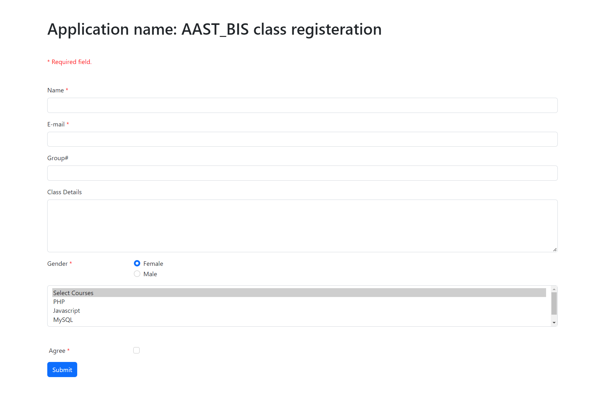
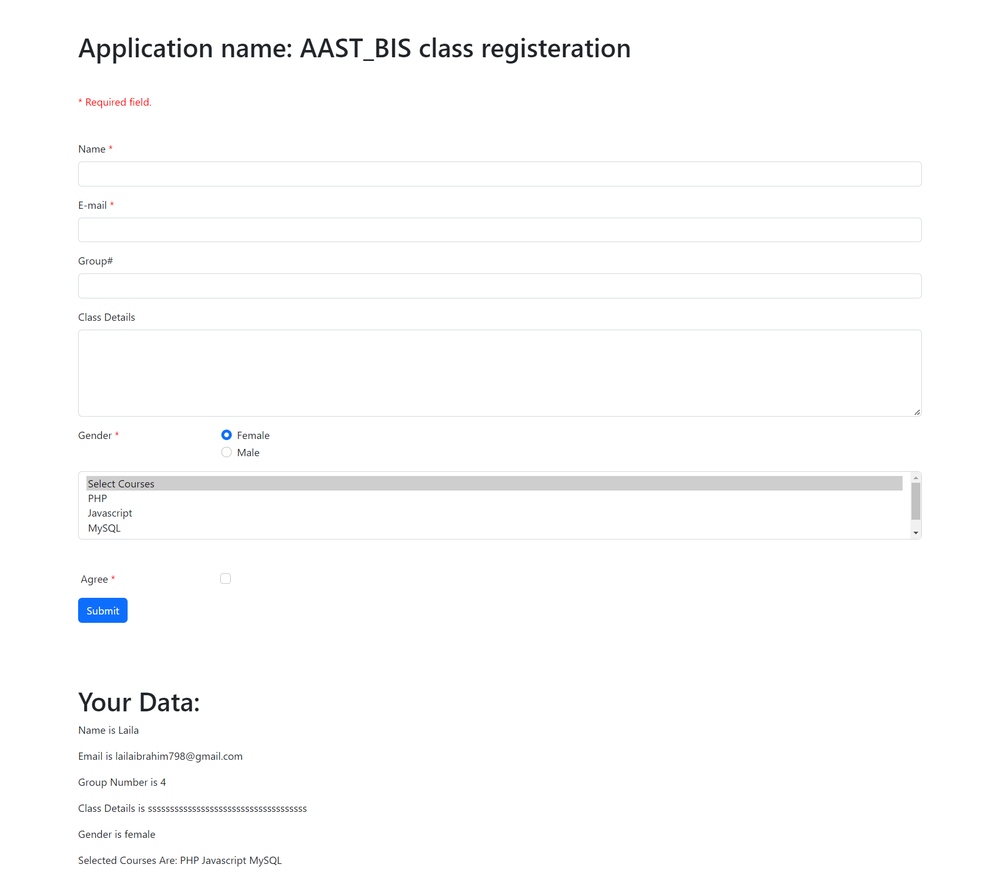
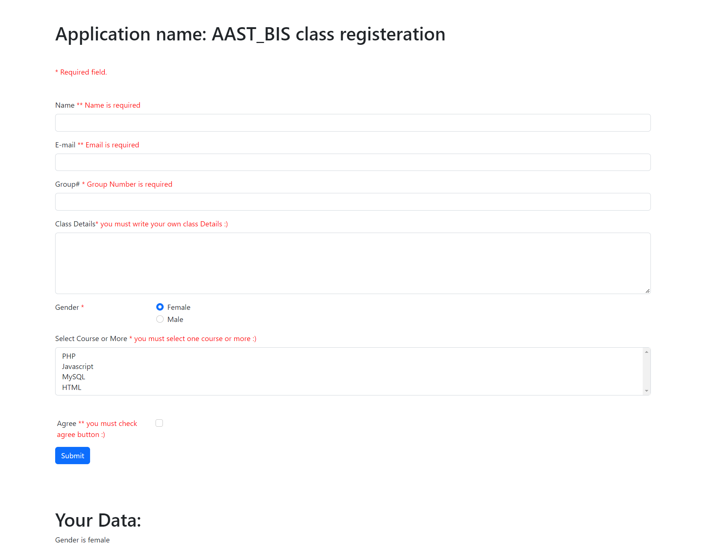
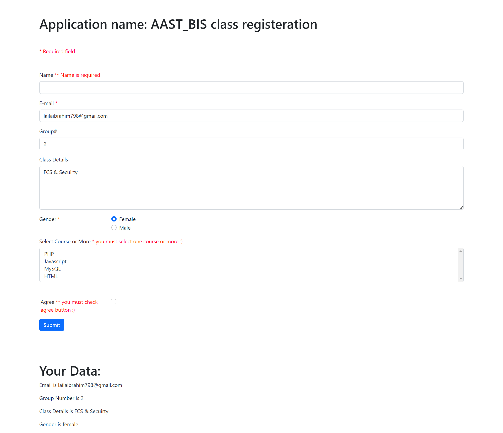
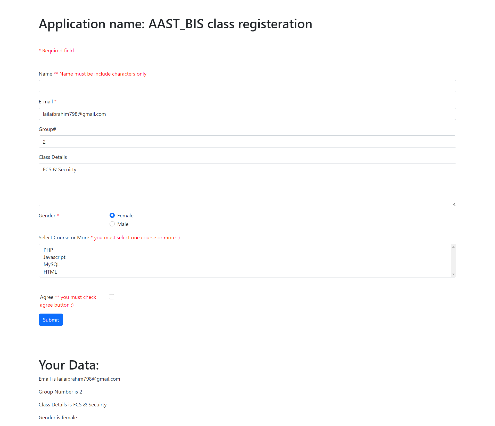
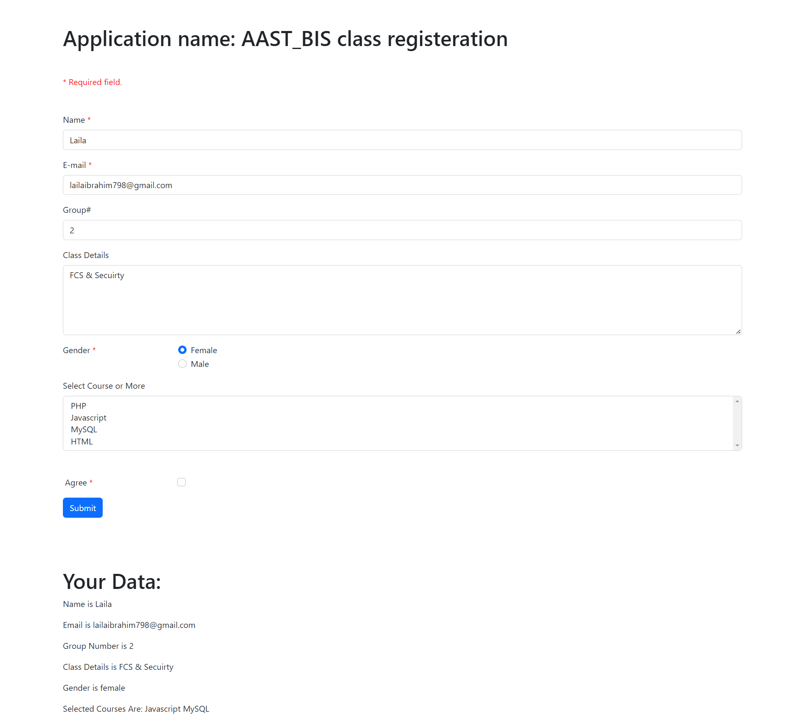

# Part 1 (Form In Browser ) as in: 
 

> Solve: Make form as in:
  

# Part 2 (Data After Pressing Submit with Button) as in:
 

> Solve: After Enter Data And Click Submit Button as in:
 

# Part 3 (form with validation and error msg after pressing submit with no data )
 

> Solve:
 1. Before write any data in the form as in: 
  
 
 2. After Submit without fill any data :( as in:
  

 3. Submit form after fill some inputs and keep form with valid data after submit as in:
   

 4. test again after enter Name input with numbers :( as in: 
   
 
 5. enter valid data as in: 
   

   
  